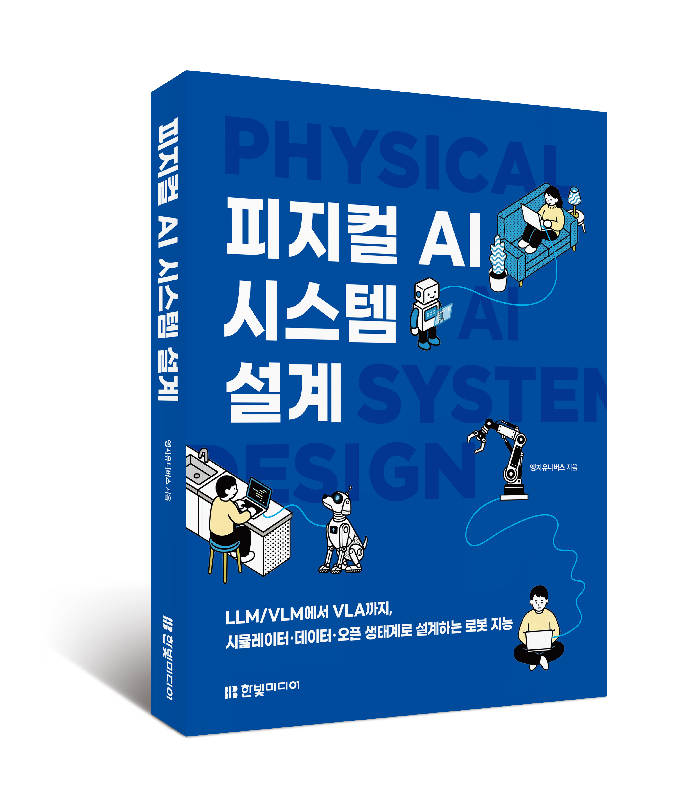

# 피지컬 AI 시스템 설계

  

『피지컬 AI 시스템 설계』의 예제 코드와 부가 자료를 제공하는 공식 저장소입니다.

## 도서 소개

이 책은 피지컬 AI 기술이 어떤 흐름으로 발전해왔고, 앞으로 로봇 지능이 어떤 구조로 설계될 것인지를 개발자 관점에서 설명합니다.

언어 모델과 비전 언어 모델에서 시작해 VLA, 로봇 학습, 시뮬레이션, 데이터 수집, 온디바이스 배포까지 피지컬 AI 시스템을 구성하는 전체 흐름을 다룹니다.

## 도서 정보

- 도서명: 피지컬 AI 시스템 설계
- 저자: 엥지유니버스
- 출판사: 한빛미디어

## 문의 및 오류 제보

도서 내용 및 예제 코드나 실행 환경 등에서 오류를 발견한 경우 engiman0401@gmail.com을 통해 남겨주세요.
