# Ubuntu 22.04 설치 방법

이 문서는 도서 예제 실행 환경을 준비하기 위해 **Ubuntu 22.04 LTS**를 설치하는 과정을 설명합니다. Windows와 Ubuntu를 함께 사용하는 듀얼 부팅 구성도 함께 다룹니다.

> [!CAUTION]
> 운영체제 설치와 파티션 변경 과정에서는 저장 장치의 데이터가 삭제될 수 있습니다. 중요한 파일을 반드시 별도의 저장 장치나 클라우드에 백업한 뒤 진행하세요.

## 구성

1. [Ubuntu 부팅 USB 만들기](#1-ubuntu-부팅-usb-만들기)
2. [Windows에서 Ubuntu 설치 공간 만들기](#2-windows에서-ubuntu-설치-공간-만들기선택)
3. [Ubuntu 설치하기](#3-ubuntu-설치하기)
4. [설치 완료 후 부팅하기](#4-설치-완료-후-부팅하기)

## 준비물

- 8GB 이상의 빈 USB 저장 장치
- Ubuntu를 설치할 PC
- 인터넷 연결
- Windows와 Ubuntu를 함께 사용할 경우 Ubuntu 설치용 여유 공간

> [!NOTE]
> 이 문서의 화면은 Ubuntu 22.04 LTS 설치 프로그램을 기준으로 합니다. PC 제조사, 메인보드, BIOS/UEFI 설정 및 Ubuntu 세부 버전에 따라 일부 화면과 메뉴 이름이 다를 수 있습니다.

---

## 1. Ubuntu 부팅 USB 만들기

이미 Ubuntu 부팅 USB가 있다면 [Ubuntu 설치하기](#3-ubuntu-설치하기)로 이동합니다.

### 1.1 Ubuntu 이미지 내려받기

1. [Ubuntu Desktop 다운로드 페이지](https://ubuntu.com/download/desktop)에 접속합니다.
2. Ubuntu 22.04 LTS가 바로 표시되지 않으면 **alternative downloads** 또는 과거 릴리스 메뉴로 이동합니다.

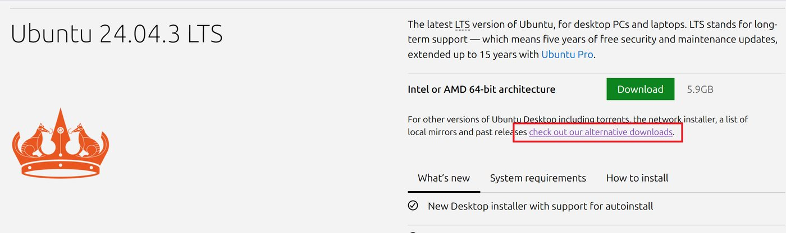

3. **Ubuntu 22.04 LTS (Jammy Jellyfish)**를 선택합니다.

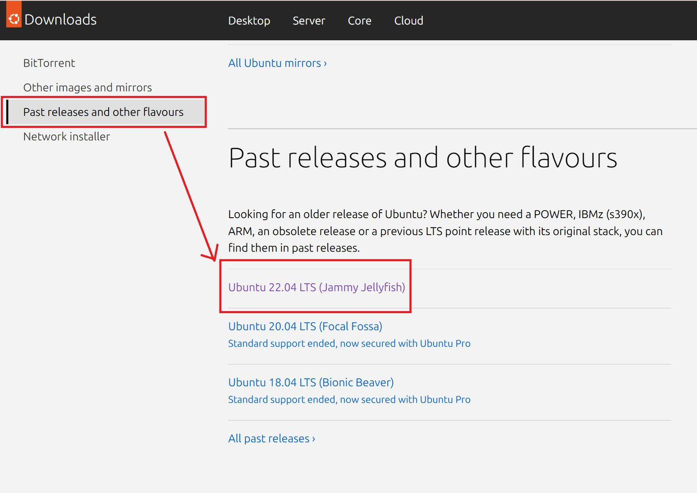

4. **64-bit PC (AMD64) desktop image**를 선택해 ISO 파일을 내려받습니다.

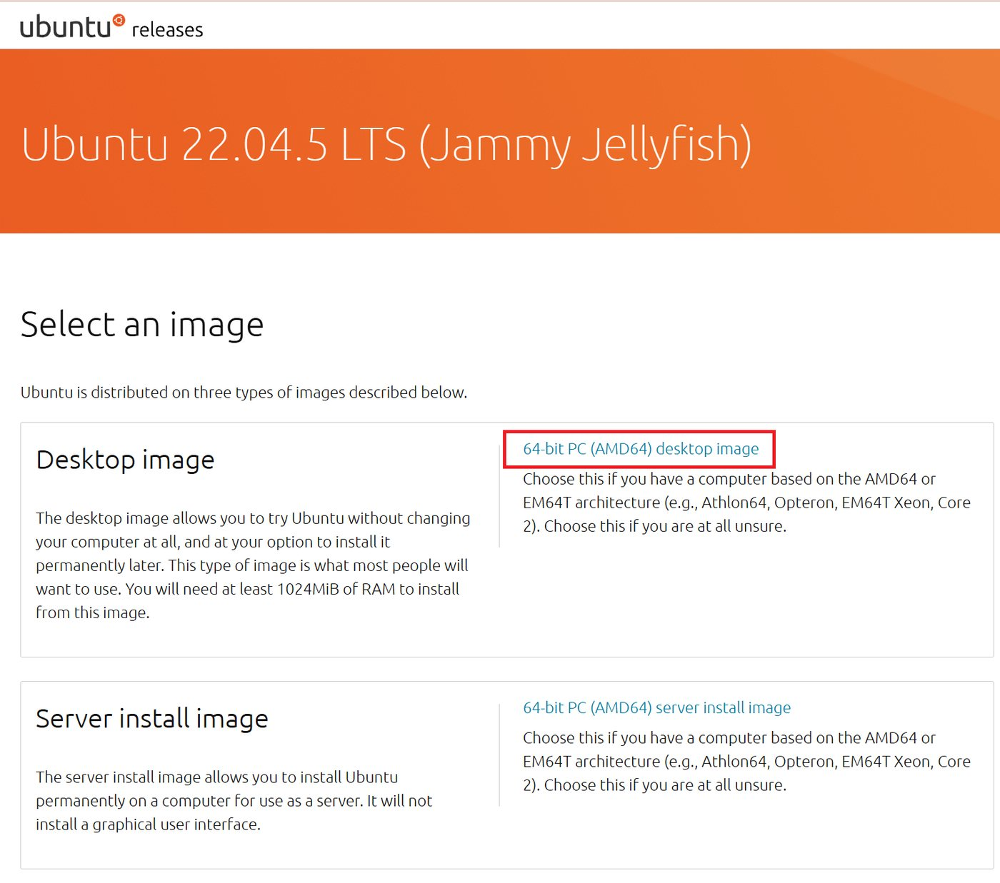

### 1.2 Rufus 설치하기

1. Windows에서 [Rufus 공식 웹사이트](https://rufus.ie/ko/)에 접속합니다.
2. 최신 Windows x64 버전을 내려받아 실행합니다.

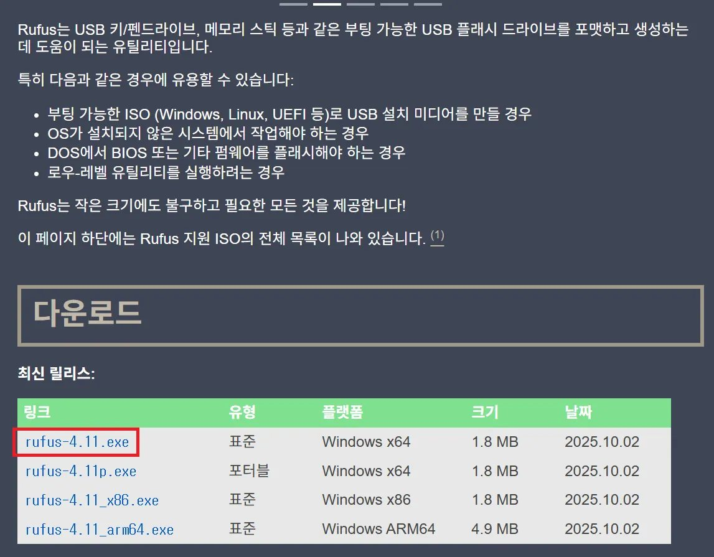

### 1.3 부팅 USB 만들기

1. 준비한 USB 저장 장치를 PC에 연결합니다.
2. Rufus의 **장치** 항목에서 연결한 USB가 맞는지 확인합니다.
3. **선택**을 누르고 앞에서 내려받은 Ubuntu ISO 파일을 지정합니다.
4. 나머지 항목은 특별한 이유가 없다면 기본값을 유지하고 **시작**을 누릅니다.

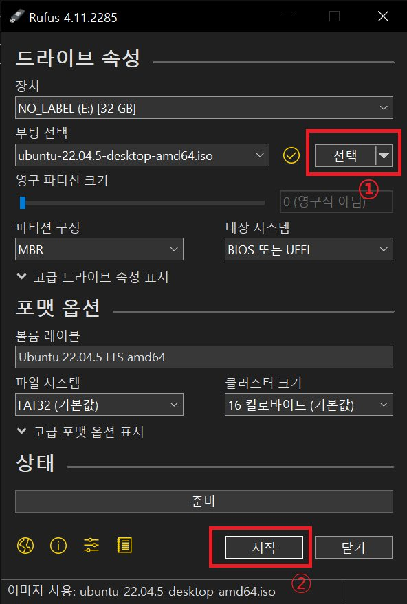

> [!CAUTION]
> 이 작업을 시작하면 선택한 USB 안의 데이터가 모두 삭제됩니다. 장치 이름과 용량을 다시 확인하세요.

5. 쓰기 방식 선택 창이 나타나면 **ISO 이미지 모드로 쓰기(권장)**를 선택하고 **OK**를 누릅니다.

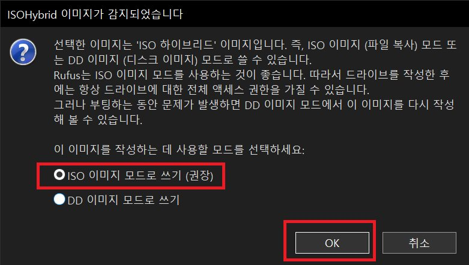

6. 추가 파일 다운로드 창이 나타나면 **예**를 눌러 진행합니다.

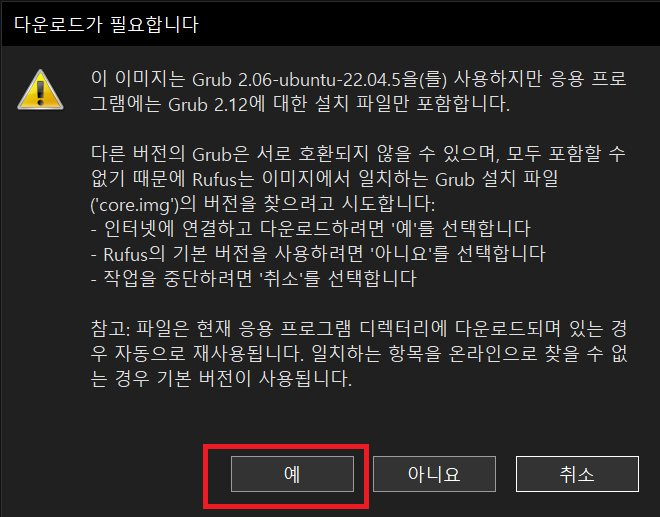

7. USB 데이터 삭제 경고를 확인한 뒤 **OK**를 누릅니다.

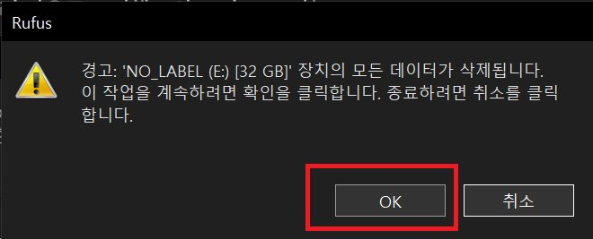

8. 작업이 끝날 때까지 기다립니다. Rufus 하단 상태가 **준비**로 표시되면 부팅 USB 제작이 완료된 것입니다.

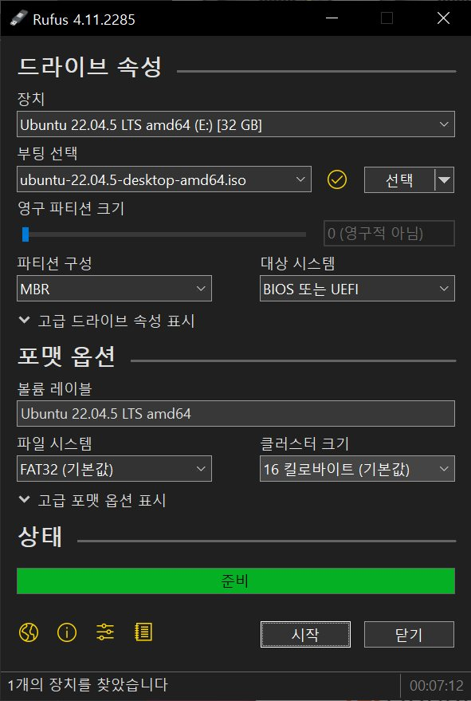

---

## 2. Windows에서 Ubuntu 설치 공간 만들기(선택)

Windows와 Ubuntu를 같은 PC에서 사용하는 **듀얼 부팅** 환경을 구성할 때만 진행합니다. Ubuntu만 단독으로 설치할 경우 이 절을 건너뛸 수 있습니다.

> [!CAUTION]
> 파티션 작업은 잘못된 저장 장치를 선택하면 기존 데이터가 손상될 수 있습니다. 디스크 번호, 드라이브 문자, 용량을 충분히 확인한 뒤 진행하세요.

### 2.1 디스크 관리 열기

1. Windows에서 `Windows + R` 키를 누릅니다.
2. 실행 창에 아래 명령을 입력하고 Enter를 누릅니다.

```text
diskmgmt.msc
```

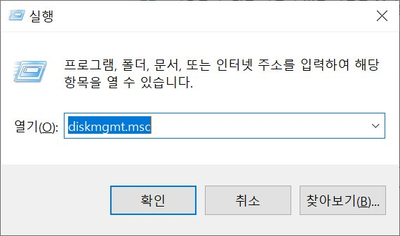

### 2.2 기존 볼륨 축소하기

1. 디스크 관리에서 Ubuntu 설치 공간을 확보할 드라이브를 선택합니다.
2. 해당 드라이브를 마우스 오른쪽 버튼으로 클릭하고 **볼륨 축소**를 선택합니다.

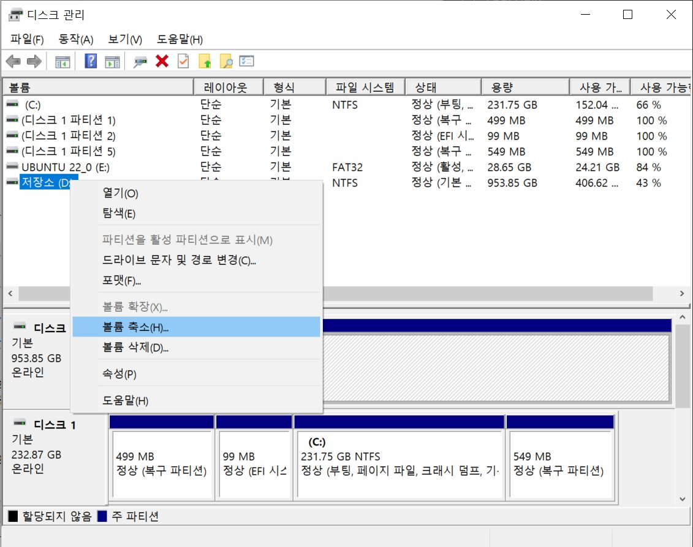

3. Ubuntu에 할당할 공간을 MB 단위로 입력하고 **축소**를 누릅니다.

예를 들어 약 200GB를 확보하려면 대략 `200000`MB를 입력할 수 있습니다. 실제로 필요한 용량은 설치할 프로그램과 데이터 규모에 따라 결정합니다.

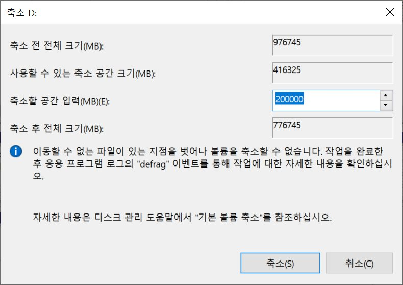

4. 작업이 끝나면 디스크 관리에 검은색으로 표시된 **할당되지 않음** 공간이 생성됩니다.
5. 이 공간에는 Windows에서 새 볼륨을 만들거나 포맷하지 않습니다. Ubuntu 설치 과정에서 사용합니다.

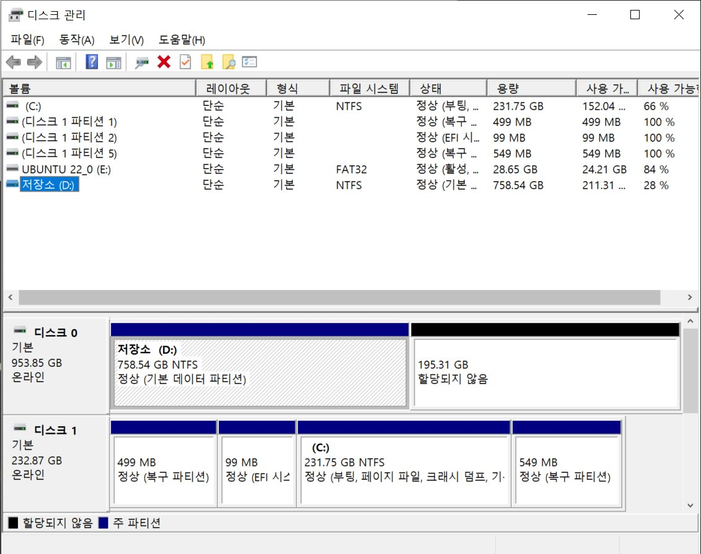

---

## 3. Ubuntu 설치하기

### 3.1 부팅 USB로 시작하기

1. Ubuntu 부팅 USB를 PC에 연결합니다.
2. PC를 켜고 제조사 로고가 나타날 때 **Boot Menu** 진입 키를 반복해서 누릅니다.

메인보드나 노트북 제조사에 따라 `F11`, `F12`, `F9`, `Esc` 등이 사용될 수 있습니다. 부팅 화면의 안내 또는 제조사 설명서를 확인하세요.

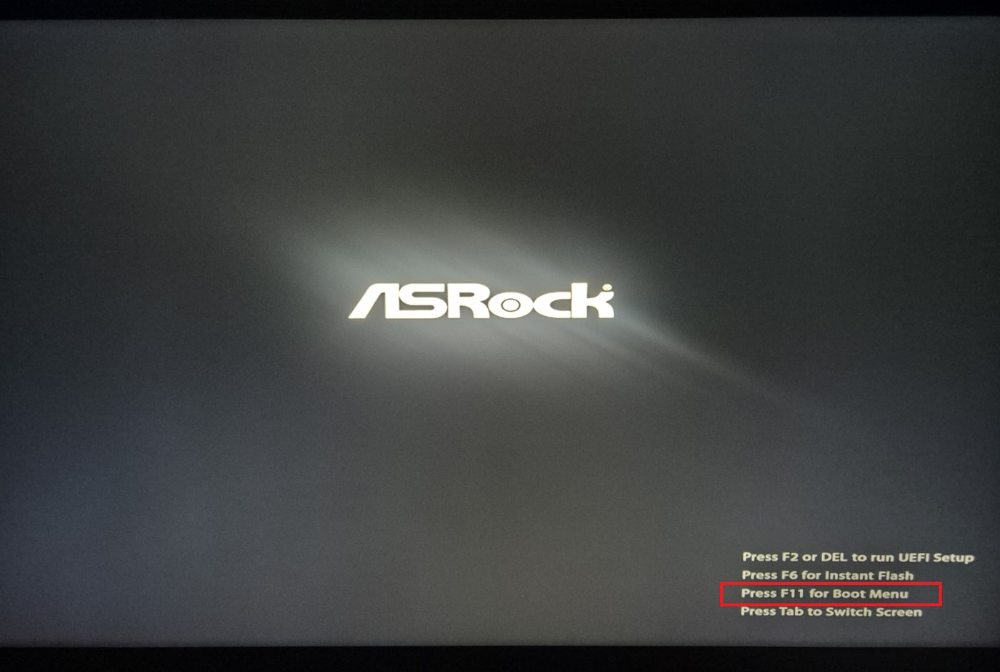

3. Boot Menu에서 연결한 Ubuntu USB를 선택하고 Enter를 누릅니다. 가능하면 `UEFI: USB ...`처럼 표시된 UEFI 항목을 선택합니다.

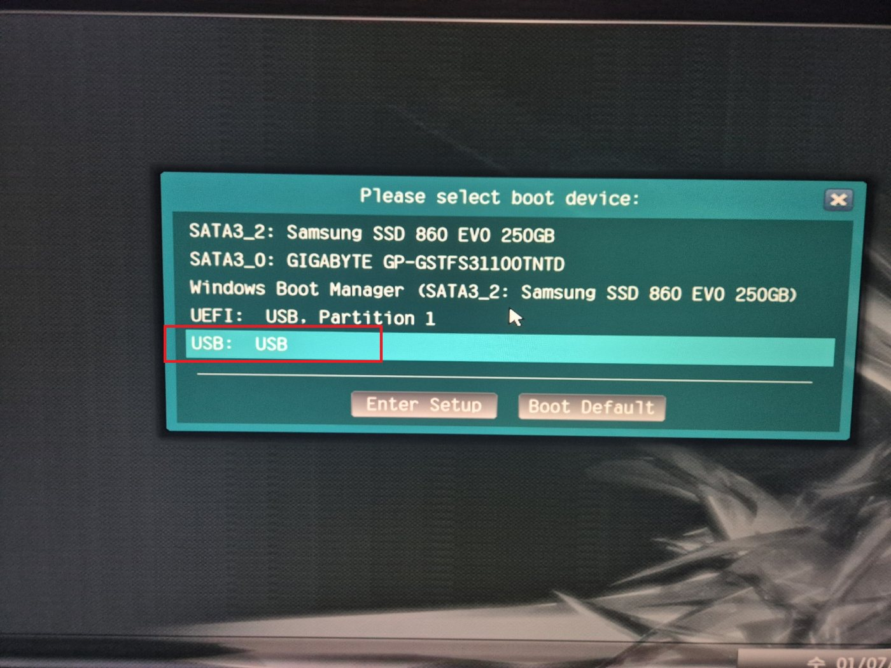

### 3.2 화면이 정상적으로 나타나지 않을 때 `nomodeset` 사용하기

일반적으로는 GRUB 메뉴에서 **Try or Install Ubuntu**를 선택해 바로 진행합니다.

다만 최신 NVIDIA GPU 등 일부 환경에서 검은 화면이 나타나거나 설치 화면으로 넘어가지 않는다면 다음 절차를 시도할 수 있습니다.

1. GRUB 메뉴에서 **Try or Install Ubuntu** 항목을 선택한 상태로 `e` 키를 누릅니다.

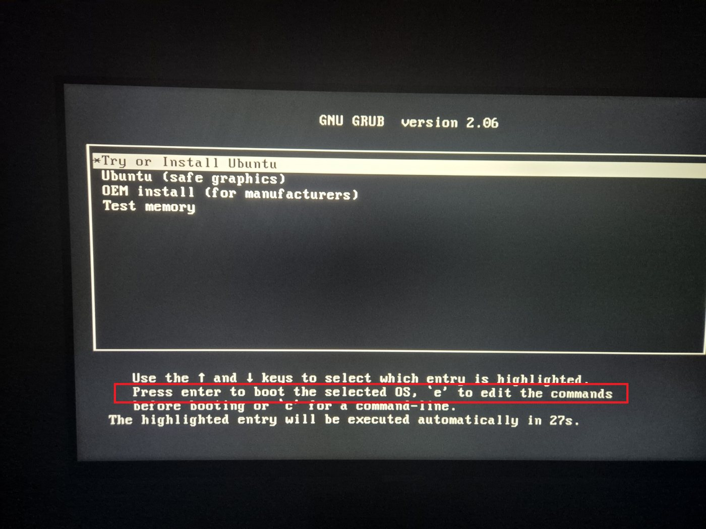

2. `splash ---`가 포함된 줄을 찾아 `splash nomodeset ---` 형태로 수정합니다.
3. `F10` 키를 눌러 수정된 설정으로 부팅합니다.

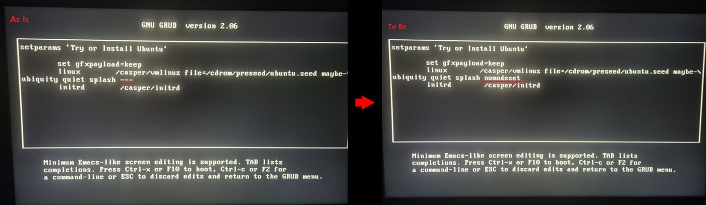

> [!NOTE]
> `nomodeset`은 설치 과정에서 그래픽 드라이버의 커널 모드 설정을 일시적으로 제한하는 옵션입니다. 화면 문제가 없는 PC에서는 추가할 필요가 없습니다. 설치 후에는 NVIDIA 드라이버를 별도로 설치하고 정상 부팅되는지 확인해야 합니다.

### 3.3 설치 프로그램 시작하기

1. 설치 화면이 나타나면 사용할 언어를 선택합니다.
2. **Ubuntu 설치**를 선택합니다.

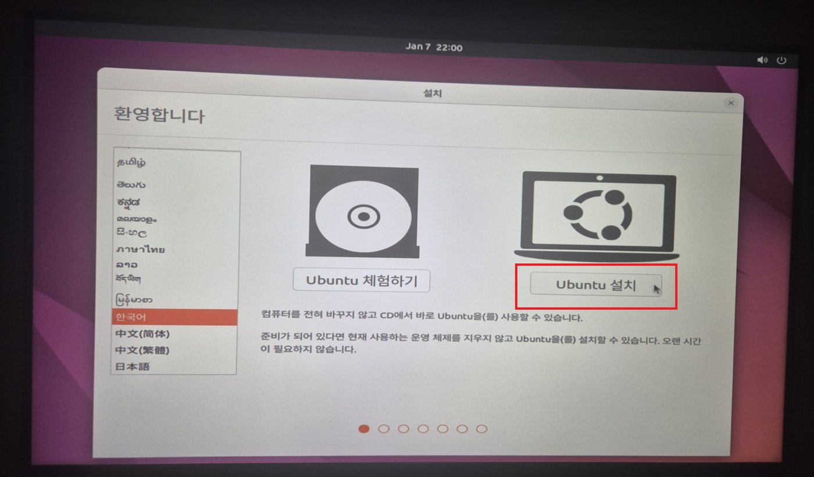

3. 키보드 배열과 설치 옵션을 선택합니다.
4. 그래픽 카드 호환 문제를 피하기 위해 별도 드라이버를 나중에 설치할 계획이라면 **그래픽과 Wi-Fi 하드웨어를 위한 서드파티 소프트웨어 설치** 옵션을 해제할 수 있습니다.

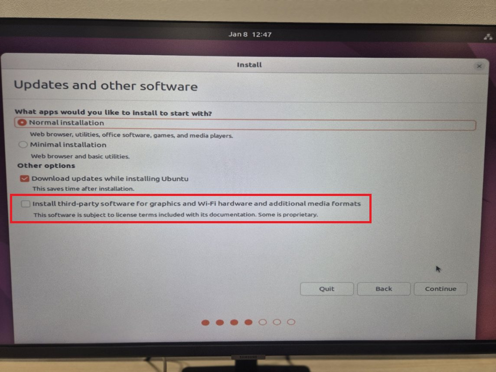

> [!NOTE]
> 설치 중 인터넷 연결이 필요한데 Wi-Fi가 인식되지 않는 경우 유선 LAN이나 스마트폰 USB 테더링을 사용할 수 있습니다.

### 3.4 설치 방식 선택하기

#### Ubuntu만 사용하는 경우

저장 장치의 기존 데이터를 모두 삭제하고 Ubuntu만 사용할 예정이라면 **Erase disk and install Ubuntu**를 선택합니다.

> [!CAUTION]
> 이 옵션을 선택하면 대상 디스크의 기존 운영체제와 파일이 삭제됩니다.

#### Windows와 듀얼 부팅하는 경우

앞에서 확보한 할당되지 않은 공간을 직접 사용하려면 **Something else**를 선택합니다.

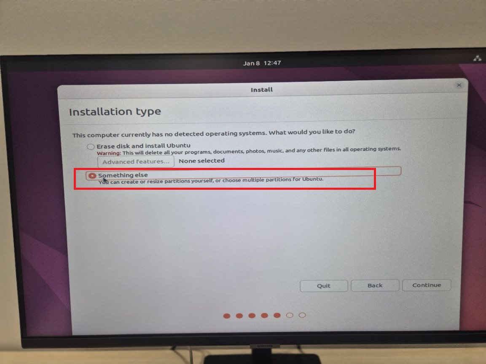

1. 목록에서 앞서 만든 **free space**를 용량으로 구분해 선택합니다.
2. `+` 또는 **Add**를 눌러 새 파티션을 만듭니다.

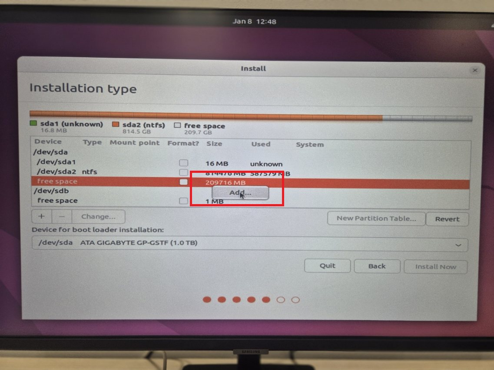

3. 새 파티션을 다음과 같이 설정합니다.

- 파티션 종류: `Primary` 또는 설치 환경에 맞는 기본값
- 파일 시스템: `Ext4 journaling file system`
- 마운트 지점: `/`
- 크기: 확보한 공간 범위 안에서 필요한 만큼 지정

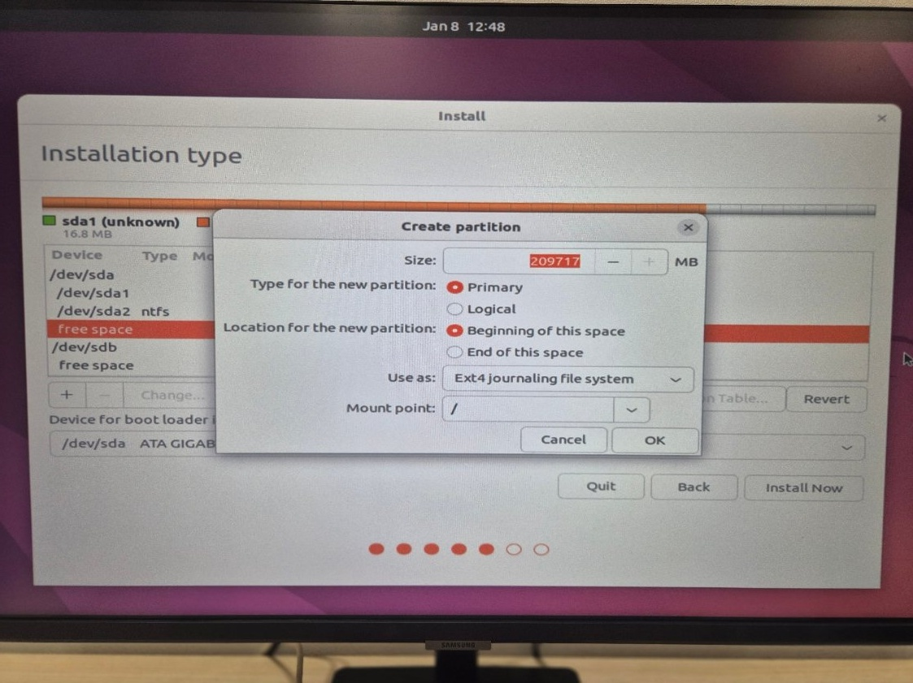

4. 생성된 Ext4 파티션과 마운트 지점 `/`가 올바르게 표시되는지 확인합니다.

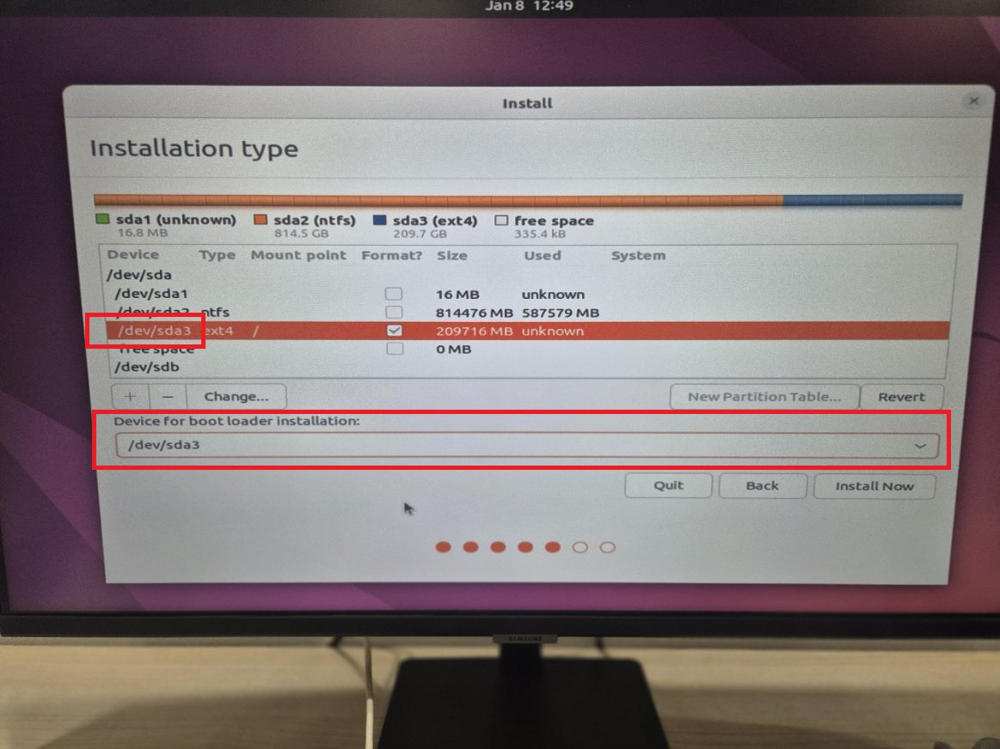

### 3.5 부트로더 설치 위치 확인하기

화면 아래쪽의 **Device for boot loader installation**에서 부트로더를 설치할 디스크를 선택합니다.

- 일반적인 UEFI 듀얼 부팅 구성에서는 Windows와 Ubuntu가 사용하는 EFI 시스템 파티션이 있는 디스크를 선택합니다.
- Ubuntu를 별도 디스크에 완전히 분리해 설치한다면 해당 디스크에 EFI 시스템 파티션이 있는지 확인하고 그 디스크를 선택합니다.
- 장치 이름은 PC마다 다르므로 `/dev/sda`, `/dev/sdb`, `/dev/nvme0n1` 등의 이름과 용량을 반드시 대조합니다.


> [!WARNING]
> 부트로더와 파티션 구성은 PC의 UEFI/BIOS 방식과 기존 디스크 구성에 따라 달라집니다. 어떤 디스크를 선택해야 할지 확실하지 않다면 설치를 중단하고 현재 파티션 구성을 먼저 확인하세요.

5. 설정을 확인한 뒤 **Install Now**를 누릅니다.
6. 파티션 변경 경고가 표시되면 변경 대상이 맞는지 확인하고 **Continue**를 누릅니다.

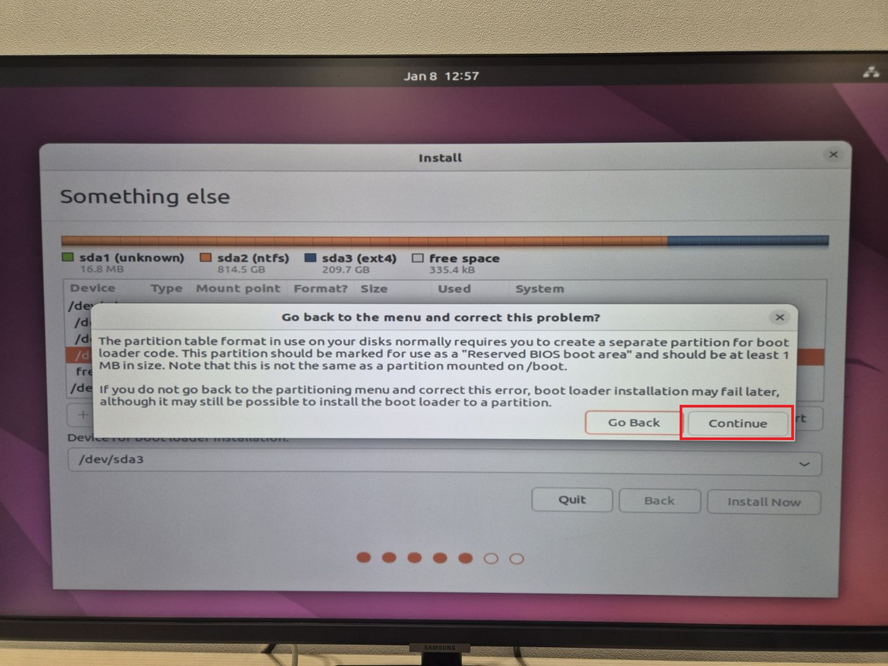

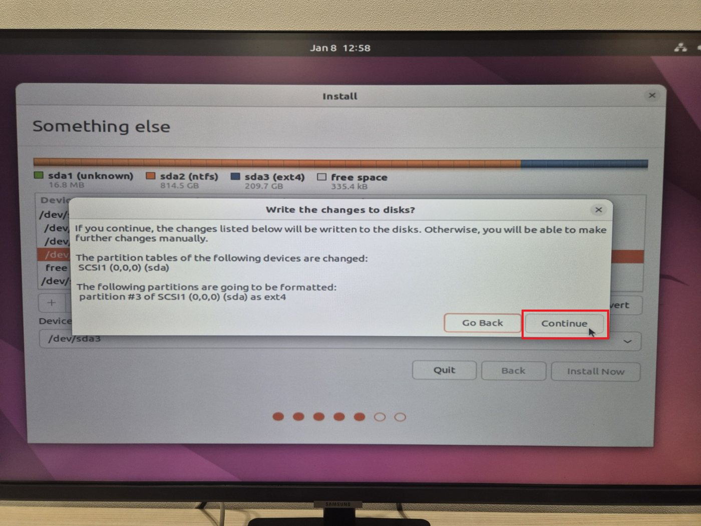

### 3.6 지역과 사용자 계정 설정하기

1. 지도에서 지역과 시간대를 선택합니다.

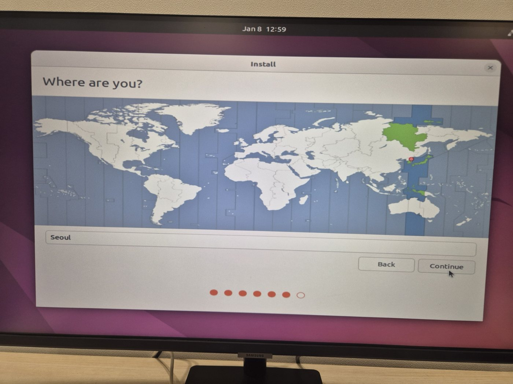

2. 이름, PC 이름, 사용자 이름과 비밀번호를 입력합니다.

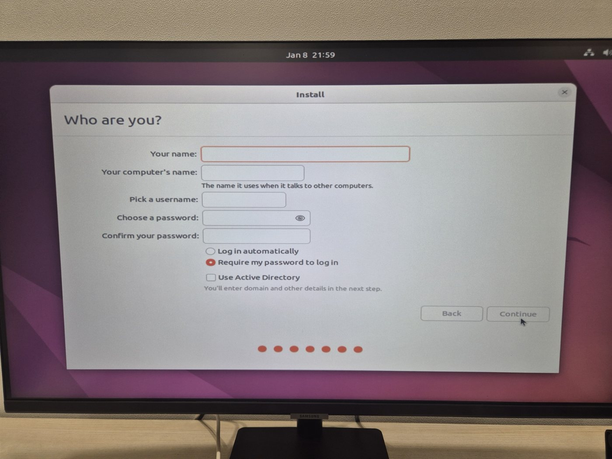

3. 설치가 완료될 때까지 기다립니다. PC 환경과 인터넷 속도에 따라 시간이 오래 걸릴 수 있습니다.

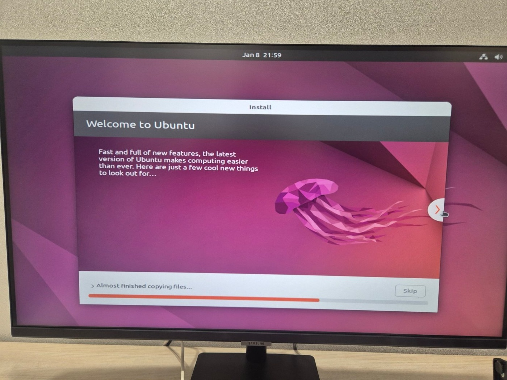

4. 설치 완료 안내가 나타나면 **Restart Now**를 눌러 재부팅합니다.

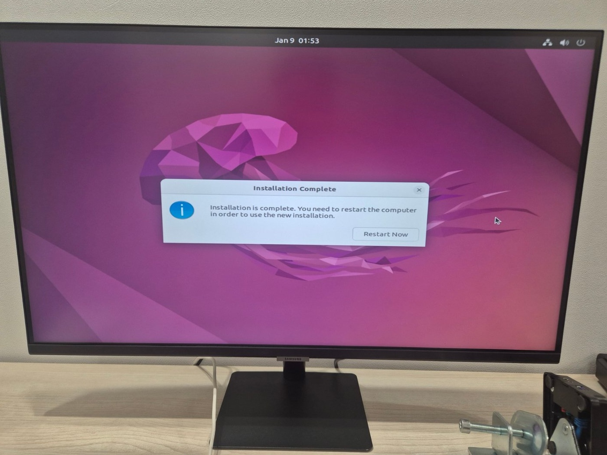

---

## 4. 설치 완료 후 부팅하기

1. 재부팅 과정에서 안내가 나오면 Ubuntu 설치 USB를 제거하고 Enter를 누릅니다.
2. 필요하면 다시 Boot Menu에 진입합니다.
3. Ubuntu로 시작하려면 **ubuntu** 항목을 선택합니다.
4. Windows로 시작하려면 **Windows Boot Manager**를 선택합니다.

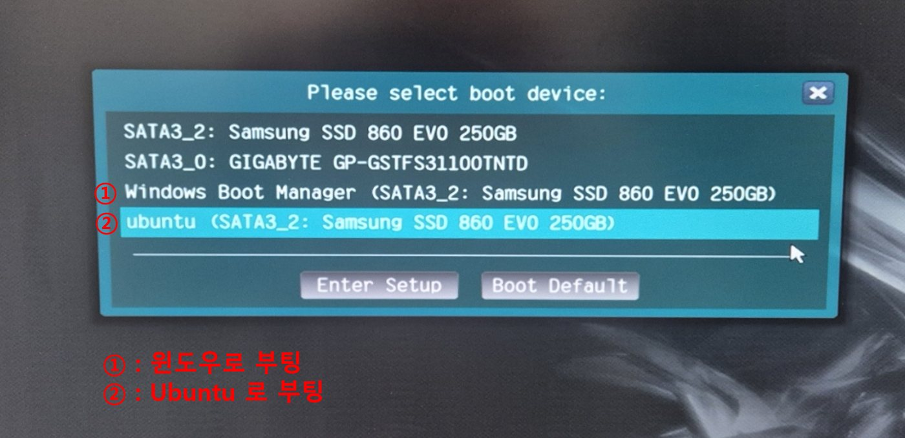

설치가 끝난 뒤 Ubuntu에 로그인하고 터미널에서 다음 명령으로 기본 패키지를 업데이트합니다.

```bash
sudo apt update
sudo apt upgrade -y
```

이후 도서 예제 실행에 필요한 드라이버, Git, Python 및 기타 개발 도구는 별도의 환경 설정 문서를 따라 설치합니다.